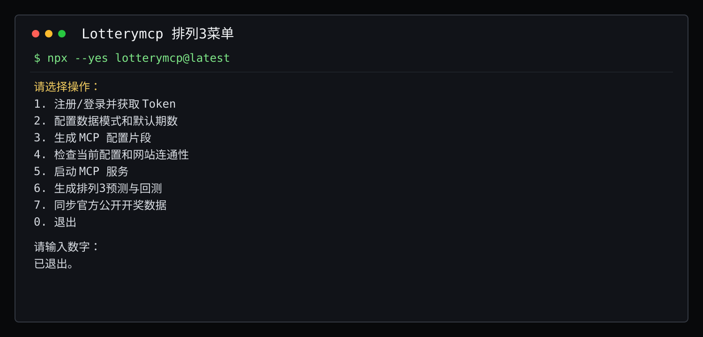
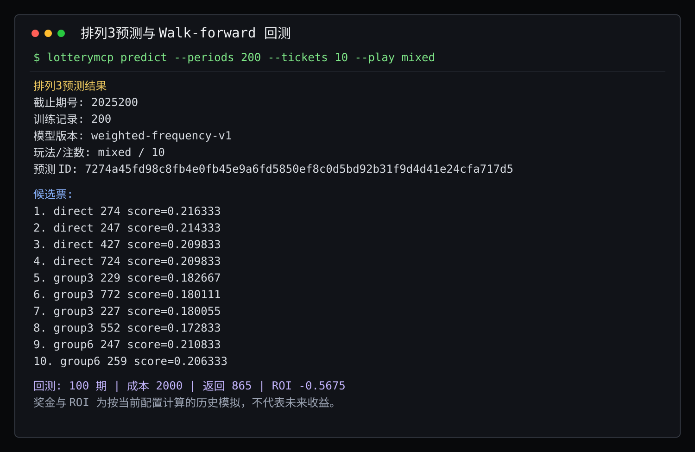

# Lotterymcp

Lotterymcp 是一个排列3（P3）历史数据、MCP 接入和本地确定性分析工具。

它支持两种数据模式：

- `remote`：使用 NEUXSBOT 接口，需要有效 Token。
- `official`：读取本地公开开奖缓存，不调用 NEUXSBOT 受控接口。

预测核心使用固定、可解释的历史频率权重，并提供无未来数据泄漏的 walk-forward 回测。候选分数只是排序分，不是中奖概率，历史回测也不代表未来收益。

快速入口：

- [GitHub 快速开始](docs/github-quickstart.zh-CN.md)
- [MCP 接入说明](docs/mcp-usage.zh-CN.md)
- [分析问题示例](docs/prompt-templates.zh-CN.md)

## 能做什么

- 读取排列3最新开奖、历史开奖、期号和摘要。
- 从中国体彩网公开接口同步排列3数据，失败时切换公开回退源。
- 从本地 JSON 文件导入排列3历史数据。
- 按直选、组三、组六或混合玩法生成候选排序。
- 对实际候选注数执行 walk-forward 回测，输出成本、名义奖金和历史 ROI。
- 保存预测账本，并在下一期开奖进入缓存后自动结算。

## 三步开始

1. 临时运行 `npx --yes lotterymcp@latest`，或全局安装 `npm i -g lotterymcp`。
2. 使用 Token 配置 remote 模式，或者先同步公开数据：

   ```bash
   lotterymcp sync --source official --limit 500
   ```

3. 生成预测与回测：

   ```bash
   lotterymcp predict --periods 200 --tickets 10 --play mixed
   ```

## 常用命令

```bash
lotterymcp init
lotterymcp doctor
lotterymcp serve
lotterymcp sync --source official --limit 500
lotterymcp sync --source file --file history.json --limit 500
lotterymcp predict --periods 200 --tickets 10 --play mixed
lotterymcp analyze pl3 --periods 200 --tickets 10
```

`analyze pl3`、`analyze p3` 和 `analyze pl3_markov` 是 `predict` 的兼容入口，均使用同一个 TypeScript 核心。

## MCP 配置

remote 模式：

```json
{
  "mcpServers": {
    "lotterymcp": {
      "command": "npx",
      "args": ["-y", "lotterymcp@latest", "serve"],
      "env": {
        "NEUXSBOT_API_BASE_URL": "https://www.neuxsbot.com",
        "NEUXSBOT_TOKEN": "your-real-token"
      }
    }
  }
}
```

official 模式：

```json
{
  "mcpServers": {
    "lotterymcp": {
      "command": "npx",
      "args": ["-y", "lotterymcp@latest", "serve"],
      "env": {
        "LOTTERYMCP_DATA_MODE": "official",
        "LOTTERYMCP_DATA_DIR": ".lotterymcp-data"
      }
    }
  }
}
```

official 模式只读取用户本地同步或导入的数据，不绕过 NEUXSBOT 授权。

## MCP 工具

- `lottery.latest`
- `lottery.history`
- `lottery.periods`
- `lottery.summary`
- `lottery.predict`

`lotteryType` 可以省略，默认使用 `pl3`；其他彩种会返回 `LOTTERYMCP_ONLY_PL3_SUPPORTED`。

## 终端效果

<table>
  <tr>
    <td width="50%"></td>
    <td width="50%"></td>
  </tr>
</table>

## 分析问题示例

- 读取最近 200 期排列3，生成 10 注 mixed 候选并展示 walk-forward 回测。
- 只生成 8 注直选候选，说明每个候选的排序分构成。
- 对比最近 100 期和 300 期的排列3位置频率、和值、跨度和奇偶结构。
- 查看预测账本中的待结算记录和已经结算的历史结果。

## 配置说明

- `NEUXSBOT_TOKEN` 环境变量优先于本地配置文件。多人机器和 CI 建议使用环境变量。
- 默认缓存目录是 `.lotterymcp-data/`，预测账本为 `pl3-predictions.json`。
- 默认单注成本为 2 元，名义奖金为直选 1040、组三 346、组六 173；可分别通过 `LOTTERYMCP_PL3_STAKE`、`LOTTERYMCP_PL3_PAYOUT_DIRECT`、`LOTTERYMCP_PL3_PAYOUT_GROUP3`、`LOTTERYMCP_PL3_PAYOUT_GROUP6` 覆盖。
- 奖金、回报和 ROI 都是按配置计算的历史模拟，不构成收益承诺。
