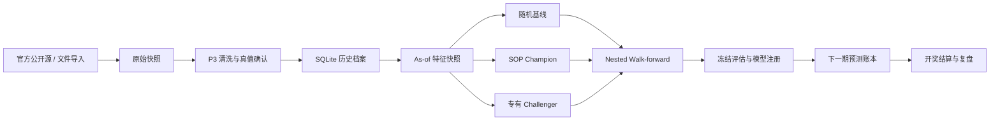

# 排列3个人研究实验室产品方案

## 1. 文档目的

本文定义 Lotterymcp 面向个人研究使用的长期产品方案。产品目标不是承诺预测中奖，而是建立一套能够持续回答以下问题的研究系统：

1. 历史数据中是否存在可重复、可验证的排列3信号？
2. SOP、统计模型和专有模型相比随机基线是否存在稳定提升？
3. 每次实验、预测和结算是否能够在未来重新复现？

本文是产品、数据、模型和工程实现的共同依据。后续功能不得绕过本文规定的数据版本、时间切分和预测账本规则。

## 2. 产品结论

产品采用三层策略体系：

- `Baseline`：理论随机基线和蒙特卡洛随机策略。
- `Champion`：可解释、确定性的 SOP 规则模型。
- `Challenger`：统计模型、专有模型和集成模型。

默认正式输出继续使用 SOP。专有模型必须在冻结测试集和实时 shadow 阶段同时满足晋级条件，才能成为新的 Champion。没有模型达到条件时，系统必须明确输出“未发现可重复优势”，不得为了产生结论而降低标准。

## 3. 产品定位

### 3.1 目标用户

- 单个研究者在自己的电脑上长期研究排列3历史数据。
- 使用 CLI、MCP 或本地报告完成数据同步、实验、预测和复盘。
- 需要完整掌握数据来源、模型参数、测试过程和历史结论。

### 3.2 产品边界

产品只处理排列3（`pl3`）：

- 只保存三位 `0..9` 开奖号码。
- 只支持直选、组三、组六和 mixed 研究口径。
- 不加入其他彩票类型，不保留多彩种注册框架。
- 不提供自动投注、资金计划、收益承诺或代购功能。
- 不建设多用户、会员、支付和云端账号系统。

### 3.3 成功标准

- 数据完整率达到 `99.9%`，未解决的数据冲突数为 0。
- 同一数据快照、代码版本、参数和随机种子产生相同结果。
- 修改未来数据不能影响任何更早的回测折叠。
- 每个预测都在开奖前写入不可变账本。
- 模型结论包含样本量、随机基线、SOP 基线和置信区间。
- 产品允许得出“模型没有优势”的结论。

## 4. 产品原则

1. 默认使用 official 本地数据，remote 作为可选来源。
2. 原始数据、规范化数据和人工修订必须分层保存。
3. 存储上限与分析窗口分离，不再因为预测只读 1000 期而丢弃更早历史。
4. 不推算下一期号，预测只绑定 `afterPeriod`。
5. 排序分不是概率，未校准模型不得展示概率。
6. ROI 是历史模拟附录，不参与默认模型晋级。
7. 正式模型必须可冻结、可回滚、可复现。
8. 研究环境可以失败，正式预测必须自动回退到当前 Champion。

## 5. 总体架构



正式 CLI/MCP 运行时继续使用 TypeScript。模型训练、统计检验和高级实验放在独立的 Python 研究工作区，不随 npm 包安装，也不影响 SOP 预测可用性。

## 6. 数据产品设计

### 6.1 数据来源

- 主来源：中国体彩网排列3公开历史数据。
- 回退来源：中彩网排列3公开历史数据。
- 兜底来源：用户导入的 P3 JSON 或 CSV 文件。
- 人工操作：只允许确认冲突和录入来源说明，不允许无记录地直接改值。

同步默认低频请求，遵守来源网站公开规则。来源不可用时保留现有数据，不以较小或空结果覆盖完整档案。

### 6.2 本地目录

```text
.lotterymcp-data/
  pl3.sqlite
  raw/
  models/
  reports/
  exports/
  backups/
```

- `pl3.sqlite`：规范化历史、实验、模型、预测和结算。
- `raw/`：按来源和获取时间保存原始响应压缩文件。
- `models/`：冻结模型及其 manifest。
- `reports/`：实验和预测报告。
- `exports/`：用户主动导出的 JSON/CSV。
- `backups/`：迁移和修订前的数据库备份。

### 6.3 SQLite 表

| 表 | 关键字段 | 用途 |
|---|---|---|
| `draws` | period, draw_date, d1, d2, d3, status | 当前确认的 P3 真值 |
| `source_snapshots` | provider, fetched_at, content_hash, raw_path | 原始来源证据 |
| `draw_observations` | period, provider, numbers, observed_at | 不同来源的观测值 |
| `draw_revisions` | period, old_value, new_value, reason, revised_at | 真值修订审计 |
| `feature_snapshots` | after_period, feature_version, data_hash, payload | As-of 特征快照 |
| `experiments` | experiment_id, spec_hash, status, code_commit | 实验注册信息 |
| `experiment_folds` | experiment_id, fold, train_range, test_range | 时间折叠 |
| `model_artifacts` | model_id, model_type, artifact_path, manifest_hash | 冻结模型 |
| `predictions` | prediction_id, after_period, model_id, created_at | 开奖前预测 |
| `prediction_tickets` | prediction_id, play_type, numbers, rank, score | 候选票 |
| `settlements` | prediction_id, target_period, result, revision | 结算记录 |
| `payout_schedules` | effective_from, play_type, stake, payout | 历史奖金规则 |

所有 schema 变更使用单向 migration。迁移前自动备份数据库；迁移失败时恢复原数据库，不允许部分升级。

### 6.4 P3 真值规则

1. 同一期号两个来源完全一致时自动确认为 `confirmed`。
2. 只有一个来源时保存为 `single_source`，可以研究但必须显示来源状态。
3. 两个来源号码或日期不一致时标记为 `conflict`，禁止进入训练和预测。
4. 人工确认必须记录证据 URL、原因和时间。
5. 修订历史数据时新增 revision，不覆盖原始观测。
6. 历史修订产生新的数据快照哈希，旧实验和旧预测仍绑定原快照。

### 6.5 数据质量检查

- `lotteryType` 只能是 `pl3`。
- 期号必须是 5 到 12 位数字并保持唯一。
- 开奖日期必须是真实存在的 `YYYY-MM-DD` 日期。
- 号码必须恰好包含三个 `0..9` 整数。
- 同一期号出现不同号码或不同日期必须进入冲突队列。
- 检测重复页面、空页、时间倒序、异常期号跳跃和来源回退。
- 期号跳跃只产生告警，不自动判定缺失，因为可能存在休市。

### 6.6 现有 JSON 迁移

首次启用 SQLite 时执行以下步骤：

1. 读取现有 `pl3.json` 和 `pl3-predictions.json`。
2. 使用当前严格 P3 校验器完成导入预检。
3. 创建带时间戳的原文件备份。
4. 在单个数据库事务中导入历史、预测和结算。
5. 对比记录数、最新期号和 predictionId。
6. 验证成功后启用 SQLite；原 JSON 不自动删除。

## 7. 特征产品设计

### 7.1 基础特征

- 百位、十位、个位的滚动数字频率。
- 全局数字频率。
- 和值、跨度和奇偶个数。
- 豹子、组三、组六结构。
- 数字遗漏期数和出现间隔。
- 最近 `10/30/50/100/200/500` 期的变化率。
- 各位置的熵、集中度和分布漂移。

### 7.2 As-of 约束

每个特征函数必须显式接收 `afterPeriod`。函数只能读取小于或等于该期号的数据，禁止读取数据库“当前最新值”。特征快照保存：

- 数据快照哈希。
- 截止期号。
- 特征版本。
- 窗口参数。
- 生成代码 commit。

任何需要全量拟合的标准化器、编码器或参数都必须在当前训练折内重新拟合。

## 8. 策略与模型体系

### 8.1 固定基线

| 模型 | 作用 |
|---|---|
| `uniform-theory` | 理论随机命中基线 |
| `random-monte-carlo` | 固定种子的随机策略分布 |
| `rolling-frequency` | 简单滚动频率基线 |
| `weighted-frequency-v1` | 当前可解释 SOP Champion |
| `dirichlet-frequency` | 带平滑的位置概率基线 |

随机基线使用不少于 10,000 次固定种子模拟，输出均值、标准差和 `2.5%/50%/97.5%` 分位数，不比较单次随机结果。

### 8.2 第一批 Challenger

1. 三个位置分别训练的正则化多项逻辑回归。
2. 预测和值、跨度和号码结构的辅助分类模型。
3. 一个限制深度和特征数量的梯度提升模型。
4. SOP 与模型的百分位排名集成。

第一阶段不使用深度神经网络、强化学习、自动神经架构搜索和无限制自动调参。

### 8.3 联合输出

所有模型最终必须产生 `000-999` 的完整直选状态表：

```text
number, rawScore, rank, calibratedProbability?
```

- 直选保留数字顺序。
- 组三得分取对应三个直选排列的平均值。
- 组六得分取对应六个直选排列的平均值。
- mixed 默认按直选 40%、组三 40%、组六 20% 使用最大余数法分配。
- 不同玩法视为不同研究对象，同一玩法内不得重复。

位置模型的独立概率乘积只能作为候选模型，不能默认代表真实联合概率。只有概率总和为 1 且通过校准测试的模型才能展示概率；其他模型统一展示 `rankScore`。

### 8.4 集成规则

- 默认使用各模型的百分位排名进行融合，避免不同评分量纲直接相加。
- 集成权重只能在内层训练折选择。
- 集成模型必须作为独立模型版本注册。
- 不允许根据某一期候选看起来是否合理临时修改权重。

## 9. 研究技术栈

### 9.1 TypeScript 正式运行时

- 数据同步、P3 校验和 SQLite 访问。
- SOP 推理、模型 artifact 验证和预测生成。
- MCP、CLI、预测账本和结算。
- 即使 Python 不可用，Champion 预测仍必须正常运行。

### 9.2 Python 研究工作区

Python 仅用于离线研究：

- `pandas`/`numpy`：数据和特征实验。
- `scikit-learn`：逻辑回归、校准和指标。
- `lightgbm` 或 `xgboost`：单一梯度提升 Challenger。
- `scipy`/`statsmodels`：统计检验。

研究环境使用独立锁文件，不进入 npm 发布包。训练完成后导出：

- 简单模型：版本化 JSON 参数。
- 复杂模型：ONNX artifact。
- 所有模型：统一 `model-manifest.json`。

manifest 至少包含模型类型、特征版本、训练范围、数据哈希、参数、依赖版本、随机种子、指标和 artifact SHA-256。

## 10. 实验制度

### 10.1 实验预注册

每个实验运行前必须冻结以下 spec：

- 研究假设。
- 数据范围和排除规则。
- 特征集合和版本。
- 模型与参数搜索空间。
- 主要指标和辅助指标。
- 训练窗口和测试窗口。
- 停止规则和晋级阈值。

修改 spec 后产生新的 `experimentId`，不得覆盖已有实验。

### 10.2 时间切分

- 数据少于 1500 期时，只允许探索和 SOP 回测，不允许模型晋级。
- 专有模型最低训练段为 1000 期。
- 最近至少 1000 期作为冻结评估区；开发期间不得查看其最终汇总结果。
- 开发区使用 nested walk-forward 完成特征选择和参数调优。
- 禁止随机 K-fold 和打乱时间顺序。

冻结评估区只能在模型 spec 完整冻结后执行。修改模型后必须注册新实验，不能复用旧冻结结果作为无偏结论。

### 10.3 多重比较控制

- 记录所有成功、失败和中止实验。
- 同一研究批次使用 Benjamini-Hochberg 控制 `FDR <= 0.05`。
- 主要指标只能有一个，其他指标标记为辅助或探索性。
- 使用按时间分块的 bootstrap 计算 95% 置信区间。
- 不允许只报告表现最好的年份、窗口或玩法。

### 10.4 训练与重训

- 研究阶段由用户手动冻结和训练。
- shadow 阶段固定模型，不按每期结果重训。
- 默认每 50 期检查一次数据漂移，每 100 期进行一次正式复评。
- 只有预定周期到达或漂移超过阈值时才创建下一模型版本。
- 模型训练失败、artifact 损坏或依赖缺失时使用当前 Champion，不临时选择其他 Challenger。

## 11. 评估指标

### 11.1 主要指标

默认主要指标为实际开奖号码在 1000 个直选状态中的归一化排名：

```text
normalizedRank = (rank - 1) / 999
```

值越低越好。该指标每期都有观测，比只统计少量直选命中更适合模型比较。

### 11.2 排名指标

- 平均和中位 `normalizedRank`。
- Mean Reciprocal Rank。
- Top 10、20、50、100 覆盖率。
- 各位置 Top-1、Top-3、Top-5 准确率。
- 组三和组六各自的 Hit@K。

### 11.3 概率指标

只对概率模型计算：

- Log Loss。
- Brier Score。
- 校准曲线和 Expected Calibration Error。
- 预测分布熵和概率集中度。

### 11.4 稳定性指标

- 按年份和连续时间块分段评估。
- 不同训练窗口下的指标方向一致性。
- 相对 SOP 和随机基线的效果差值。
- 特征分布和预测分布漂移。

### 11.5 命中和 ROI

直选 Top10 在 500 期内随机期望命中约 5 次，方差很大，因此精确命中和 ROI 只能作为辅助展示。

ROI 必须使用开奖日期对应的 `payout_schedules`。历史奖金规则未知时，只展示成本和命中，不计算 ROI。

## 12. Champion/Challenger 晋级

Challenger 必须同时满足：

1. 冻结评估区至少 1000 期。
2. 默认主要指标相对 SOP 改善至少 2%。
3. 时间分块 bootstrap 的 95% 置信区间下界大于 0。
4. 多重比较修正后 `q <= 0.05`。
5. 至少三个连续时间分段中改善方向一致。
6. 任一主要分段相对 SOP 的退化不超过 5%。
7. 概率模型的校准指标不劣于 SOP 对照概率模型 5% 以上。
8. 完成至少 300 期实时 shadow，主要指标方向与冻结评估一致。
9. 预测、artifact 和实验可以在另一环境中复现。

未满足任何一项时不得替换 Champion。阈值调整必须产生新研究版本，不能追溯修改已有实验结论。

## 13. 预测产品流程

每次生成预测时执行：

1. 检查 P3 数据状态和未解决冲突。
2. 确定最新已确认 `afterPeriod`。
3. 加载冻结 Champion 和处于 shadow 状态的 Challenger。
4. 使用各自固定的数据窗口生成 1000 状态排序。
5. 转换为请求玩法和注数。
6. 在开奖前原子写入不可变预测账本。
7. 输出模型版本、数据哈希、特征版本和候选差异。

同一模型、数据和参数生成相同 `predictionId`。多个模型对同一 `afterPeriod` 的预测分别保存，不互相覆盖。

## 14. 结算与历史修订

- `targetPeriod` 是 `afterPeriod` 之后实际出现的第一条已确认开奖。
- 不猜测跨年、休市或调整后的下一期号。
- 首次结算写入 revision 1，之后不可修改。
- 历史开奖修订时新增 settlement revision，并同时保留原结算。
- 报告默认展示最新 revision，但必须能够查看原始结算。
- 开奖前未成功写入账本的候选不得补记为正式预测，只能标记为 replay。

## 15. 产品界面

### 15.1 第一阶段 CLI

在保留当前命令的基础上，研究版规划以下命令：

```text
lotterymcp data status
lotterymcp data sync --full
lotterymcp data conflicts
lotterymcp data export --format json
lotterymcp experiment create spec.json
lotterymcp experiment run EXPERIMENT_ID
lotterymcp experiment report EXPERIMENT_ID
lotterymcp model list
lotterymcp model promote MODEL_ID
lotterymcp predict --compare
lotterymcp ledger list
lotterymcp ledger replay PREDICTION_ID
```

实验创建、训练和晋级只通过 CLI 完成，防止 AI 客户端意外修改研究状态。

### 15.2 MCP

第一阶段继续保留五个工具：

- `lottery.latest`
- `lottery.history`
- `lottery.periods`
- `lottery.summary`
- `lottery.predict`

MCP 默认只读已确认数据和已冻结模型。实验控制工具在研究流程稳定前不开放。

### 15.3 本地 Dashboard

Dashboard 放在实验闭环完成之后，包含：

- 数据健康和冲突队列。
- 实验注册、运行状态和折叠结果。
- SOP、Challenger 和随机基线对比。
- 下一期候选、模型重合和差异。
- 预测账本、结算 revision 和复盘。
- 按时间、模型、窗口和玩法筛选的报告。

Dashboard 只监听本机地址，默认不提供远程访问和账号体系。

## 16. 异常与失败处理

| 场景 | 产品行为 |
|---|---|
| 官方源 403/WAF | 整批切换回退源并记录告警 |
| 两个来源都失败 | 保留旧数据，允许文件导入，不生成空缓存 |
| 来源数据冲突 | 标记 conflict，阻止相关区间训练和预测 |
| 数据不足 100 期 | 只允许数据查看，不生成 SOP 预测 |
| 数据不足 1000 期 | 允许 SOP，不允许专有模型晋级 |
| Python 不可用 | 禁止训练，TypeScript Champion 继续运行 |
| 模型 artifact 损坏 | 校验失败并回退 Champion |
| 实验中断 | 状态记为 interrupted，可从已完成折叠恢复 |
| 数据库写入中断 | 事务回滚，保留上一个完整版本 |
| 预测账本锁冲突 | 等待后失败，不绕过锁写入 |
| 开奖延迟或休市 | 保持 pending，不猜期号 |
| 历史开奖修订 | 新数据版本、新实验 ID、新结算 revision |
| 多个模型结论冲突 | 并列展示，不根据当前候选人工选模型 |
| 长期没有模型胜出 | 保留 SOP，并输出无优势结论 |

## 17. 本地安全与资源边界

- Token 仅用于可选 remote 模式，不写入实验报告和模型 manifest。
- SQLite、原始快照和模型默认保存在用户目录。
- 数据导出前提示其中可能包含本地路径和研究记录。
- 默认同时只运行一个训练实验。
- 单个实验默认 CPU 线程不超过逻辑核心数的一半。
- 单个实验默认运行上限 2 小时，超时标记为 interrupted。
- 自动保留最近 5 个数据库备份和所有正式模型 artifact。

## 18. 交付路线

### 阶段 1：全量数据档案

交付 SQLite、全量同步、原始快照、冲突队列、JSON 迁移和备份恢复。

退出条件：数据完整率达到 99.9%，所有现有 JSON 数据迁移结果一致。

### 阶段 2：实验基础设施

交付 As-of 特征、实验 spec、nested walk-forward、随机蒙特卡洛和报告格式。

退出条件：未来数据修改不能影响历史折叠，同一实验可以完全复现。

### 阶段 3：基线与专有模型

交付五个固定基线、逻辑回归、梯度提升模型、artifact 导出和 TypeScript 推理。

退出条件：所有模型在统一实验框架中完成冻结评估，不以 ROI 选择模型。

### 阶段 4：Shadow 与晋级

交付实时预测登记、300 期 shadow、模型注册表、Champion 晋级和回滚。

退出条件：每期预测都可证明在开奖前生成，晋级规则自动执行。

### 阶段 5：本地 Dashboard

交付数据、实验、预测、账本和报告五个视图。

退出条件：核心研究流程无需直接编辑数据库或 JSON 文件。

## 19. 测试与验收

### 数据测试

- 多页同步、回退、重复页、空页和限频。
- 非 P3、非法日期、非法号码和冲突期号。
- 来源冲突、人工确认、历史修订和数据库迁移。
- 事务回滚、备份恢复和 JSON 往返导入导出。

### 特征与实验测试

- 每个特征的 As-of 边界测试。
- 修改未来数据不影响早期折叠。
- 标准化器和模型只在训练折拟合。
- 实验 spec 和结果哈希稳定。
- 固定种子蒙特卡洛结果可重复。

### 模型测试

- 1000 个直选状态完整且无重复。
- 组三三个排列、组六六个排列转换正确。
- 概率总和、校准输入和 artifact schema 校验。
- Python 导出与 TypeScript 推理结果在容差内一致。
- 模型失败时正确回退 Champion。

### 预测与结算测试

- predictionId 稳定、重复执行 upsert 和跨进程锁。
- 预测必须早于目标期开奖时间。
- 不猜测 targetPeriod。
- 原结算与修订结算同时保留。
- replay 不计入实时 shadow 指标。

### 发布验收

```text
npm ci
npm run build
npm test
npm audit --omit=dev
npm pack --dry-run --workspace lotterymcp-core
npm pack --dry-run --workspace lotterymcp-server
npm pack --dry-run --workspace neuxnbcp
npm pack --dry-run --workspace lotterymcp
git diff --check
```

Python 研究工作区还必须通过依赖锁定、单元测试、类型检查和导出模型一致性测试。

## 20. 已锁定的产品决策

- 产品只支持排列3。
- official 是个人研究推荐模式，remote 保持兼容。
- SOP 是初始 Champion，专有模型从 Challenger 开始。
- TypeScript 是正式运行时，Python 只用于隔离的离线研究。
- SQLite 保存全量历史和实验，JSON 用于迁移与交换。
- 默认主要指标是实际号码归一化排名，不是 ROI。
- 冻结测试区不少于 1000 期，shadow 不少于 300 期。
- 训练失败不影响 Champion 预测。
- MCP 第一阶段保持五个现有工具，不开放训练和晋级操作。
- Dashboard 最后建设，不先于数据和实验闭环。

## 21. 最终产品判断

个人研究版 Lotterymcp 的核心资产不是某个单独算法，而是完整、可审计的数据档案和实验制度。产品首先保证每个结论都能被重新验证，然后才比较模型是否存在优势。

如果长期评估未发现任何专有模型稳定优于 SOP 和随机基线，这仍然是有效研究结论，系统不应为了维持“预测产品”定位而隐藏或修改该结果。

